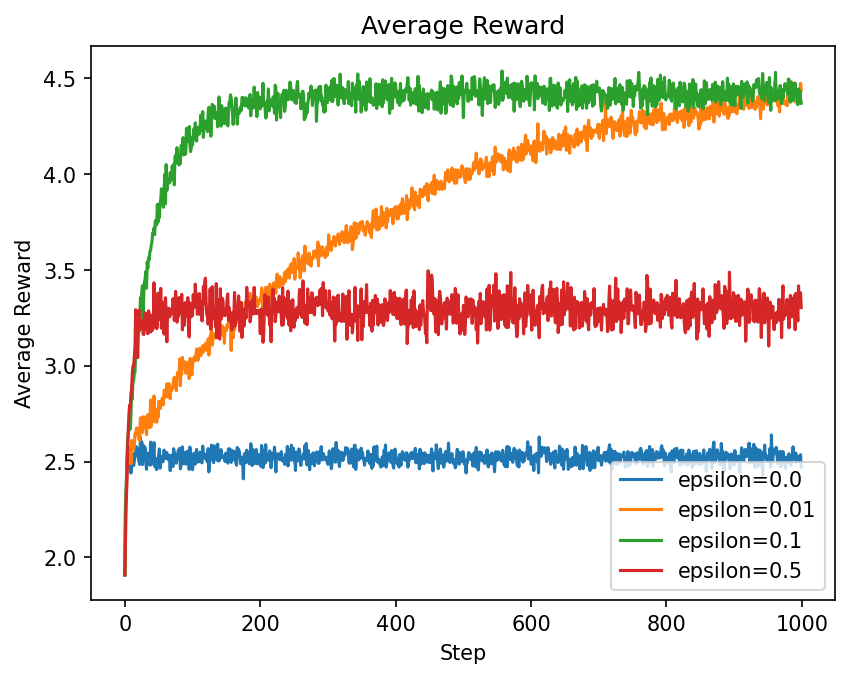
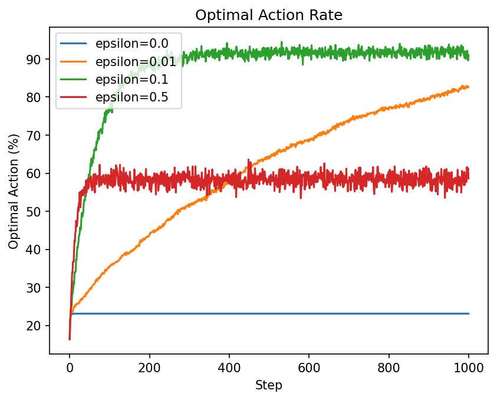

# Multi-Armed Bandit 强化学习实验

本项目是强化学习实践的第一个阶段，通过多臂老虎机（Multi-Armed Bandit）理解强化学习最基础的几个概念：

- Action
- Reward
- Action Value
- Exploration vs Exploitation
- ε-greedy
- 增量式价值更新
- 多次独立实验
- ε 衰减

## 1. 实验目标

本阶段实验按照下面的顺序进行：

```text
单次 Bandit
    ↓
ε-greedy
    ↓
比较不同 ε
    ↓
多次独立实验
    ↓
平均 Reward / 最优动作选择率
    ↓
Decaying ε
```

最终需要回答两个问题：

1. Agent 如何通过 Reward 逐渐估计每个动作的价值？
2. 如何在 Exploration 和 Exploitation 之间取得平衡？

## 2. Bandit 环境

实验使用 6 个动作，其真实平均 Reward 为：

```python
true_means = np.array([
    1.2,
    3.4,
    4.7,
    1.5,
    1.0,
    -0.5
])
```

对应：

| 动作 | 真实平均 Reward |
|---|---:|
| 1 | 1.2 |
| 2 | 3.4 |
| 3 | 4.7 |
| 4 | 1.5 |
| 5 | 1.0 |
| 6 | -0.5 |

因此真实最优动作是第 3 个动作。

Python 中下标从 0 开始，所以：

```python
optimal_action = np.argmax(true_means)
```

得到：

```text
2
```

## 3. Bandit 中的强化学习元素

Bandit 是最简单的强化学习问题之一。

它没有复杂的状态变化，可以先写成：

$$
A_t \rightarrow R_t
$$

| RL 概念 | Bandit 中的含义 |
|---|---|
| State | 本阶段暂时没有变化状态 |
| Action | 选择哪一个老虎机 |
| Reward | 当前动作得到的随机反馈 |
| Q(a) | Agent 对动作长期平均 Reward 的估计 |
| Policy | 根据当前 Q(a) 决定下一步动作 |
| Exploration | 尝试当前不确定的动作 |
| Exploitation | 选择当前估计最好的动作 |

## 4. 环境真实价值与 Agent 估计价值

实验中必须严格区分：

- `true_means`：环境真实动作价值
- `q`：Agent 当前估计的动作价值

代码：

```python
true_means = np.array([
    1.2,
    3.4,
    4.7,
    1.5,
    1.0,
    -0.5
])

q = np.zeros(n_actions)
```

一开始：

```text
true_means = [1.2, 3.4, 4.7, 1.5, 1.0, -0.5]

q = [0, 0, 0, 0, 0, 0]
```

环境知道真实情况，但 Agent 不知道。

Agent 必须通过实际获得的 Reward 逐渐学习。

### 4.1 Agent 不能偷看环境答案

选择动作时应该使用：

```python
best_actions = np.flatnonzero(q == q.max())
```

不能写成：

```python
best_actions = np.flatnonzero(
    true_means == true_means.max()
)
```

否则 Agent 会直接知道真实最优动作，实验就失去了学习意义。

`true_means` 只应该用于环境生成 Reward：

```python
reward = rng.normal(
    loc=true_means[action],
    scale=1.0
)
```

## 5. Reward 是随机的

对于动作 `a`，Reward 从正态分布中采样：

$$
R_t \sim \mathcal{N}(q_*(a), 1)
$$

例如第 3 个动作的真实价值为：

$$
q_*(a)=4.7
$$

但一次 Reward 并不一定等于 4.7。

可能得到：

```text
3.9
5.1
4.3
6.0
...
```

所以必须区分：

```text
Reward = 一次随机反馈
Q(a)   = 长期平均价值估计
```

## 6. 动作选择次数 N(a)

代码中：

```python
N[action] += 1
```

这里的 `N[action]` 不是总训练轮数。

它表示：

```text
动作 action 被选择了多少次
```

例如：

```text
N = [10, 70, 5, 12, 3, 0]
```

表示：

- 动作 1 被选择 10 次
- 动作 2 被选择 70 次
- 动作 3 被选择 5 次
- ...

总交互次数才是：

```python
N.sum()
```

## 7. 动作价值更新

使用样本平均更新：

$$
\alpha = \frac{1}{N(a)}
$$

然后：

$$
Q(a) \leftarrow Q(a) + \alpha \left[R-Q(a)\right]
$$

代码：

```python
N[action] += 1

alpha = 1.0 / N[action]

q[action] = q[action] + alpha * (
    reward - q[action]
)
```

其中：

```python
reward - q[action]
```

就是当前的预测误差。

可以理解成：

```text
新估计
=
旧估计
+
学习率 × 预测误差
```

这个更新结构以后还会出现在 Q-Learning 和 DQN 中。

## 8. ε-greedy

纯 Greedy 每次都选择当前估计最大的动作：

$$
a = \arg\max_a Q(a)
$$

问题在于：

> 如果早期因为随机 Reward 错误地高估了某个次优动作，Agent 可能永远不再尝试其他动作。

因此使用 ε-greedy。

规则：

```text
概率 ε：
    随机选择动作
    → Exploration

概率 1 - ε：
    选择当前 Q 最大的动作
    → Exploitation
```

代码：

```python
if rng.random() < epsilon:

    action = rng.integers(n_actions)

else:

    best_actions = np.flatnonzero(
        q == q.max()
    )

    action = rng.choice(best_actions)
```

## 9. 随机种子

代码：

```python
rng = np.random.default_rng(seed)
```

`seed` 用来控制随机数生成过程。

例如：

```python
seed = 42
```

相同 seed 会得到相同的随机数序列，因此实验可以复现。

注意：

```text
固定 seed ≠ 没有随机性

固定 seed = 可重复的随机过程
```

## 10. 单次 Bandit 实验

第一版实验运行：

```python
n_steps = 1000
epsilon = 0.1
```

每一步的流程：

```text
当前 q
   ↓
ε-greedy
   ↓
选择 action
   ↓
环境生成 reward
   ↓
N[action] += 1
   ↓
计算 alpha
   ↓
更新 q[action]
   ↓
进入下一步
```

也就是：

$$
Q_t \rightarrow A_t \rightarrow R_t \rightarrow Q_{t+1}
$$

## 11. 单次实验比较不同 ε

分别尝试：

```text
ε = 0
ε = 0.1
ε = 0.5
```

单次实验可以观察：

- 最终估计的 Q
- 每个动作的选择次数
- 平均 Reward
- 最终认为的最优动作

但单次实验存在一个明显问题：

> 结果很容易受到随机种子的影响。

例如 `ε = 0` 有时第一次就选中了真正最优动作，因此一次实验看起来会非常完美。

这不能说明纯 Greedy 一定最好。

## 12. 多次独立实验

为了降低随机性的影响，将实验升级为：

```python
n_runs = 1000
n_steps = 1000
```

即：

```text
1000 次独立实验
×
每次 1000 step
```

数据结构：

```python
all_rewards = np.zeros(
    (n_runs, n_steps)
)
```

可以理解为：

```text
            step 0   step 1   ...   step 999

run 0          R        R               R
run 1          R        R               R
run 2          R        R               R
...
run 999        R        R               R
```

每一次 run 使用不同 seed：

```python
seed = run
```

因此：

```text
run 0   → seed 0
run 1   → seed 1
run 2   → seed 2
...
```

每次实验随机过程不同，但整套实验仍然可复现。

## 13. 平均 Reward

对 1000 次实验的同一个 step 求平均：

```python
mean_rewards = np.mean(
    all_rewards,
    axis=0
)
```

得到：

$$
\bar{R}_t
=
\frac{1}{N}
\sum_{i=1}^{N}
R_t^{(i)}
$$

它表示：

> 在第 t 个 step，这种策略平均能够获得多少 Reward。

实验结果图：



## 14. 最优动作选择率

每一步记录是否选择真实最优动作：

```python
if action == optimal_action:
    optimal_actions[step] = 1
```

否则保持 0。

然后：

```python
optimal_action_rate = np.mean(
    all_optimal_actions,
    axis=0
)
```

得到：

$$
P(A_t=A^*)
$$

它表示：

> 在第 t 个 step，1000 次独立实验中有多少比例选择了真实最优动作。

实验结果图：



## 15. 固定 ε 对比结果

比较：

```text
ε = 0
ε = 0.01
ε = 0.1
ε = 0.5
```

实验结果大致如下：

| ε | 最优动作率 | 平均 Reward | 现象 |
|---:|---:|---:|---|
| 0 | 约 23% | 较低 | 很多实验锁死在次优动作 |
| 0.01 | 约 82% | 后期较高 | 探索太少，找到最优动作较慢 |
| 0.1 | 约 92% | 最高 | 探索与利用平衡较好 |
| 0.5 | 约 58% | 较低 | 探索过多 |

### 15.1 ε = 0

纯 Greedy 不一定表现差。

它的问题是：

```text
如果早期选对
→ 可能表现很好

如果早期选错
→ 很容易长期停留在次优动作
```

所以主要问题是：

```text
稳定性差，容易被早期随机结果锁死
```

### 15.2 ε = 0.01

探索很少。

优点：

```text
找到最优动作后，利用率很高
```

缺点：

```text
找到最优动作需要更长时间
```

### 15.3 ε = 0.1

当前实验中表现最好。

它同时保证：

```text
有足够探索
+
大多数时间利用当前最优动作
```

### 15.4 ε = 0.5

Agent 能充分探索各个动作，因此 Q 估计通常比较完整。

但即使已经知道最优动作，仍然有大量时间随机探索，因此平均 Reward 被明显拉低。

## 16. 最优动作率的理论上限

假设 Agent 已经完全知道真实最优动作。

ε-greedy 仍然有 ε 的概率随机选择。

当前共有 6 个动作，因此：

$$
P(A=A^*)
=
(1-\varepsilon)
+
\varepsilon \frac{1}{6}
$$

当：

$$
\varepsilon=0.1
$$

有：

$$
P(A=A^*)
=
0.9
+
0.1\times\frac16
\approx
91.67\%
$$

实验曲线最终也稳定在约 92%。

当：

$$
\varepsilon=0.5
$$

有：

$$
P(A=A^*)
=
0.5
+
0.5\times\frac16
\approx
58.33\%
$$

实验结果同样接近 58%。

这说明实验曲线与理论预期一致。

## 17. Decaying ε

固定 ε 存在一个矛盾：

```text
ε 太小
→ 前期探索不足

ε 太大
→ 后期仍然频繁探索
```

因此进一步使用随训练变化的 ε：

```text
前期 ε 大
→ 多探索

后期 ε 小
→ 多利用
```

本实验设置：

```python
epsilon_start = 0.5
epsilon_end = 0.01
decay_steps = 800
```

使用线性衰减：

$$
\varepsilon_t
=
\varepsilon_{\text{start}}
+
(\varepsilon_{\text{end}}
-
\varepsilon_{\text{start}})
\frac{t}{T}
$$

代码：

```python
ratio = min(
    step / decay_steps,
    1.0
)

epsilon = (
    epsilon_start
    +
    (epsilon_end - epsilon_start)
    * ratio
)
```

前 800 step：

```text
0.50
 ↓
0.40
 ↓
0.30
 ↓
0.20
 ↓
0.10
 ↓
0.01
```

800 step 以后保持：

```text
ε = 0.01
```

ε 衰减曲线：


## 18. 每个 run 中 ε 如何变化

实验仍然是：

```text
1000 runs
×
1000 steps
```

但每个 run 都重新初始化 Agent 和 ε。

例如：

```text
run 1
    step 0      ε = 0.50
    step 400    ε ≈ 0.255
    step 800    ε = 0.01
    step 999    ε = 0.01

run 2
    step 0      ε = 0.50
    ...
```

因此不是：

```text
1000 个 run 共用一条 ε 曲线
```

而是：

```text
每一个 run 都独立执行一次完整的 ε 衰减过程
```

## 19. ε、α、Q 的区别

这是 Bandit 阶段最容易混淆的三个量。

| 变量 | 含义 | 控制什么 |
|---|---|---|
| ε | Exploration rate | 怎么选动作 |
| α | Learning rate | 新经验影响多大 |
| Q(a) | Action value estimate | Agent 当前学到了什么 |

可以直接记：

```text
ε = 怎么选
α = 怎么学
Q = 学到了什么
```

每一个 step 的完整过程：

```text
ε_t
 ↓
选择 action
 ↓
得到 reward
 ↓
N[action] += 1
 ↓
计算 alpha
 ↓
更新 Q(action)
```

## 20. 固定 ε 与 Decaying ε

最终比较：

```text
fixed ε = 0.1
```

和：

```text
decay ε = 0.5 → 0.01
```

固定 `ε = 0.1`：

```text
前期能探索
后期仍然保持 10% 探索
```

Decaying ε：

```text
前期高 ε
→ 快速收集信息

后期低 ε
→ 减少不必要探索
```

当：

$$
\varepsilon=0.01
$$

且 Agent 已经知道最优动作时：

$$
P(A=A^*)
=
0.99
+
0.01\times\frac16
\approx
99.17\%
$$

因此 Decaying ε 的核心思想是：

```text
前期 Exploration
+
后期 Exploitation
```

## 21. 当前项目结构

```text
reinforcement-learning-practice/
└── bandit/
    ├── 01_basic_bandit.py
    ├── 02_epsilon_compare.py
    ├── 03_epsilon_decease.py
    └── plots/
```

### `01_basic_bandit.py`

完成：

```text
单次 Bandit
+
ε-greedy
+
Q(a) 增量更新
```

### `02_epsilon_compare.py`

完成：

```text
多次独立实验
+
不同固定 ε 对比
```

### `03_epsilon_decease.py`

完成：

```text
多次独立实验
+
Decaying ε
```

## 22. 本阶段核心结论

### 22.1 Reward 不等于 Value

Reward 是一次随机反馈：

$$
R_t
$$

Q(a) 是长期平均价值估计：

$$
Q(a)
$$

因此单次 Reward 高或低，都不能直接说明一个动作长期好或坏。

### 22.2 Agent 不知道环境真值

环境真实价值属于 Environment：

$$
q_*(a)
$$

Agent 内部维护的是：

$$
Q(a)
$$

Agent 必须通过实际交互得到 Reward，再逐渐逼近真实价值。

### 22.3 价值更新来自预测误差

核心更新：

$$
Q(a)
\leftarrow
Q(a)
+
\alpha
\left[
R-Q(a)
\right]
$$

这个结构可以概括为：

```text
旧估计
+
学习率 × 预测误差
```

后面的 Q-Learning 和 DQN 仍然会保留这种基本形式。

### 22.4 Exploration 和 Exploitation 必须平衡

只利用：

```text
可能过早相信错误动作
```

只探索：

```text
会浪费大量 Reward
```

因此强化学习需要在两者之间做权衡。

### 22.5 单次实验不能代表算法性能

强化学习实验存在随机性。

所以：

```text
一次运行结果
≠
算法真实性能
```

应该进行多次独立实验并取平均：

```text
multiple independent runs
```

这也是后续强化学习实验的重要方法。

### 22.6 Decaying ε 更符合学习过程

训练前期：

```text
Agent 知道得少
→ 应该多探索
```

训练后期：

```text
Agent 已经积累了经验
→ 应该多利用
```

因此：

$$
\varepsilon_t \downarrow
$$

是非常自然的探索策略。

## 23. 与 Q-Learning 的联系

Bandit 中的动作价值只有：

$$
Q(a)
$$

因为不存在真正变化的状态。

后面进入 GridWorld 后，会加入状态：

$$
S_t
$$

动作价值升级为：

$$
Q(s,a)
$$

也就是：

> 在状态 s 下选择动作 a，到底有多好？

Bandit 中的更新：

$$
Q(a)
\leftarrow
Q(a)
+
\alpha
\left[
R-Q(a)
\right]
$$

到 Q-Learning 时会升级为：

$$
Q(s,a)
\leftarrow
Q(s,a)
+
\alpha
\left[
r
+
\gamma
\max_{a'}
Q(s',a')
-
Q(s,a)
\right]
$$

可以看到核心结构仍然是：

```text
旧 Q
+
学习率 × (目标 - 当前 Q)
```

Bandit 阶段学到的价值更新思想会直接延续到后面。

## 24. 与 DQN 的联系

Bandit 中：

```text
Q(a)
```

直接保存在一个数组中。

GridWorld / Q-Learning 中：

```text
Q(s, a)
```

可以保存在 Q-table 中。

到了 DQN：

```text
Q(s, a)
```

不再由表格直接保存，而是由神经网络估计：

$$
Q_\theta(s,a)
$$

因此整个学习路线可以理解为：

```text
Bandit
Q(a)
    ↓
Q-Learning
Q(s, a)
    ↓
DQN
Qθ(s, a)
```

## 25. 本阶段代码思维总结

整个 Bandit Agent 可以压缩成：

```text
初始化 Q
初始化 N

for each step:

    根据 ε-greedy 选择动作

    从环境得到 Reward

    更新 N[action]

    计算 alpha

    更新 Q[action]
```

核心闭环：

$$
Q_t
\rightarrow
A_t
\rightarrow
R_t
\rightarrow
Q_{t+1}
$$

本阶段真正需要掌握的不是某几行 NumPy 代码，而是理解：

```text
为什么需要探索
为什么 Reward 是随机的
为什么 Q 要通过经验估计
为什么需要重复实验
为什么 ε 可以随时间变化
```

## 26. 下一阶段：GridWorld

Bandit 只研究：

$$
A_t
\rightarrow
R_t
$$

下一阶段 GridWorld 会第一次正式加入状态：

$$
S_t
\xrightarrow{A_t}
R_t,S_{t+1}
$$

也就是说，问题会从：

```text
哪个动作总体最好？
```

升级成：

```text
在当前状态下，应该选择哪个动作？
```

下一阶段重点引入：

- State
- State Transition
- Episode
- Return
- Discount Factor
- Policy
- State Value
- Action Value

学习路线继续：

```text
Bandit
    ↓
GridWorld
    ↓
Q-Learning
    ↓
DQN
    ↓
Policy Gradient
    ↓
Actor-Critic
    ↓
PPO
```
